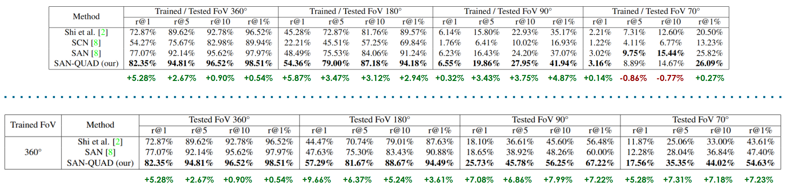

<h1 align="center">SAN-QUAD: Quadruple Semantic Align Net</h1>

    
    
    <!--  -->
    
    
    
    <!--  -->
   <!--   -->

This repository refers to the work [Enhancing Ground-to-Aerial Image Matching for Visual Misinformation Detection Using Semantic Segmentation](https://arxiv.org/abs/2502.06288) presented at the [AI4MFDD 2025 workshop](https://warwick.ac.uk/fac/sci/dcs/research/siplab/ai4mfdd2025/) at [WACV 2025](https://wacv2025.thecvf.com/).

The work's webpage is available [here](https://matteopannacci.github.io/SemanticAlignNet-QUAD/).

## Abstract

The recent development of generative AI techniques, which has increased the online diffusion of altered images and videos, raises concerns about the credibility of digital media accessible on the Internet and shared by information channels and social networks. Domains that rely on this data, such as journalism, forensic analysis, and earth observation, suffer because of this problem. At this aim, being capable of geolocating a non-geo-tagged ground-view image without external information, like GPS coordinates, is becoming crucial.
This study addresses the challenge of linking a ground-view image, on different FoV values, to its corresponding satellite image without relying on GPS data. A novel four-stream Siamese-like architecture, Quadruple Semantic Align Net (SAN-QUAD), was introduced to achieve this. SAN-QUAD expands previous SOTA methods, leveraging semantic segmentation applied to both ground and satellite images. The obtained results on the CVUSA dataset show notable improvements, up to 9.8%, over previous methods when tested across all available fields of view (FoV).

## Model Overview

The architecture is composed of four branches, two for the ground viewpoint and two for the satellite one. Each branch takes as input either an RGB image or a semantic segmentation mask and produces a
feature volume. The volumes relative to the same viewpoint are then combined into the final feature representations which are compared to obtain the most likely orientation and perform the matching.

## Results

## Dataset

The original subset of CVUSA from [Predicting Ground-Level Scene Layout from Aerial Imagery](https://arxiv.org/pdf/1612.02709) is enriched with additional features obtained from the RGB images. Each sample of the new dataset consists of 5 different types of data:

1. Ground RGB Image ([original](https://arxiv.org/pdf/1612.02709))
2. Ground Semantic Segmentation Mask (ours)
3. Ground Depth Estimation Mask (ours)
4. Satellite RGB Image ([original](https://arxiv.org/pdf/1612.02709))
5. Satellite Semantic Segmentation Mask (from [Learning from Unlabelled Data with Transformers: Domain Adaptation for Semantic Segmentation of High Resolution Aerial Images](https://arxiv.org/abs/2404.11299))

The enriched dataset is available for download [here](https://drive.google.com/file/d/11DR7zhd6wchdyt8DSkTY2JGgf_jrtf1D).

## Requirements

1. This code uses a `tensorflow` docker with libraries `opencv-python 4.8.0.74` `pillow 10.0.0` `transformers`, `torch`, `gradio_imageslider`, `gradio 4.14.0`, `torchvision`, `huggingface_hub` and runs on modern GPU of at least 6GB of memory
2. We run the code with `Python 3.9.2`
3. Download the enriched CVUSA subset

## Steps

- Clone this repository
  - `git clone https://github.com/MatteoPannacci/SemanticAlignNet-QUAD.git`
- For training run the following command from the shell:
  - `python train_quad_no_session.py --train_grd_noise 360 --train_grd_FOV $YOUR_FOV --test_grd_FOV $YOUR_FOV --name $MODEL_NAME`
  - This command will run the python file `train_quad_no_session.py`, inside it there are other possible parameters to pass as input or to leave as default value
  - `$YOUR_FOV` choose a value bewteen 0° and 360°, that is the FoV value used for the ground view images
  - The trained model will be saved in the path `./saved_models/$MODEL_NAME/`, a folder for each trained epoch will be created together with a `train.txt` file with a log of the training
- For testing run the following command from the shell:
  - `python test_quad_no_session.py --test_grd_noise 360 --test_grd_FOV $YOUR_FOV --input_path $INPUT_FOLDER --output_path $OUTPUT_FOLDER`
  - This command will run the python file `test_quad_no_session.py`, inside it there are other possible parameters to pass as input or to leave as default value
  - `$INPUT_FOLDER` is the path containing the keras checkpoint load
  - `$YOUR_FOV` choose a value bewteen 0° and 360°, that is the FoV value used for the ground view images
  - The results of the testing phase will be saved in a file `test.txt` within the `$OUTPUT_FOLDER`
- For training and testing different architectures other versions of the train and test files are provided
- Dataset
  - Once you downloaded the dataset you will have the following folders:
    - `bingmap` this folder contains the original satellite view images
    - `polarmap` - `normal` this subfolder contains the polar transformed satellite images - `segmap` this subfolder contains the polar transformed segmetation mask images
    - `segmap` here are contained the original segmented mask images
      - `streetview` this folder contains the ground view images (streetview)
      - `streetview_depth` this folder contains the depth estimation masks of the ground view images
      - `streetview_segmentation` this folder contains the semantic segmentation masks of the ground view images

## Acknowledgments

This project in an extension of the methodology proposed in the following works:

- [Where am I looking at? Joint Location and Orientation Estimation by Cross-View Matching](https://arxiv.org/abs/2005.03860)
- [A Semantic Segmentation-guided Approach for Ground-to-Aerial Image Matching](https://arxiv.org/abs/2404.11302)

## Citation

If you use this code or the models, please give credit to the following paper:

    @inproceedings{mule2025enhancing,
        title={Enhancing Ground-to-Aerial Image Matching for Visual Misinformation Detection Using Semantic Segmentation},
        author={Mule, Emanuele and Pannacci, Matteo and Goudarzi, Ali Ghasemi and Pro, Francesco and Papa, Lorenzo and Maiano, Luca and Amerini, Irene},
        booktitle={Proceedings of the Winter Conference on Applications of Computer Vision},
        pages={795--803},
        year={2025}
    }
